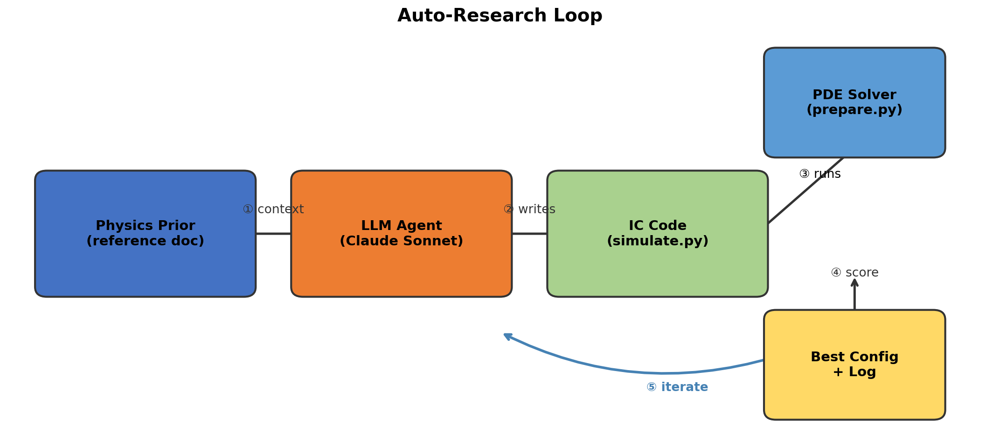
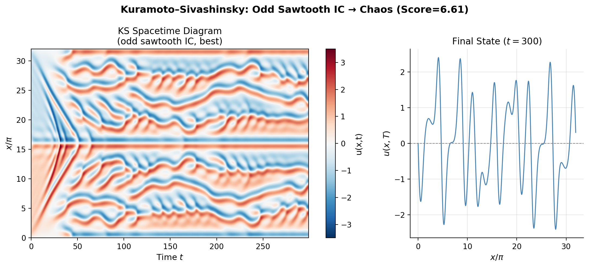
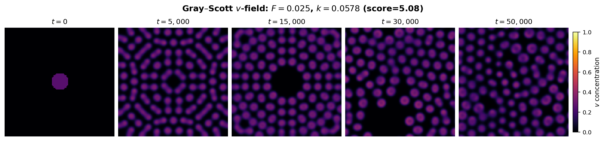
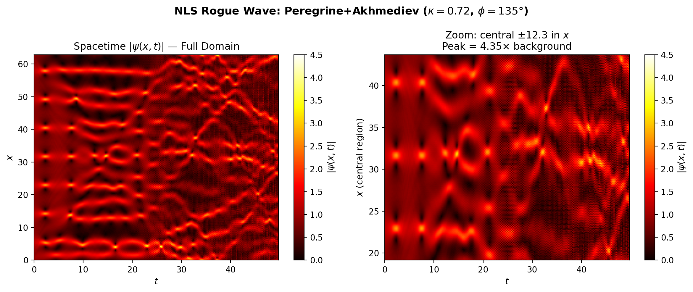
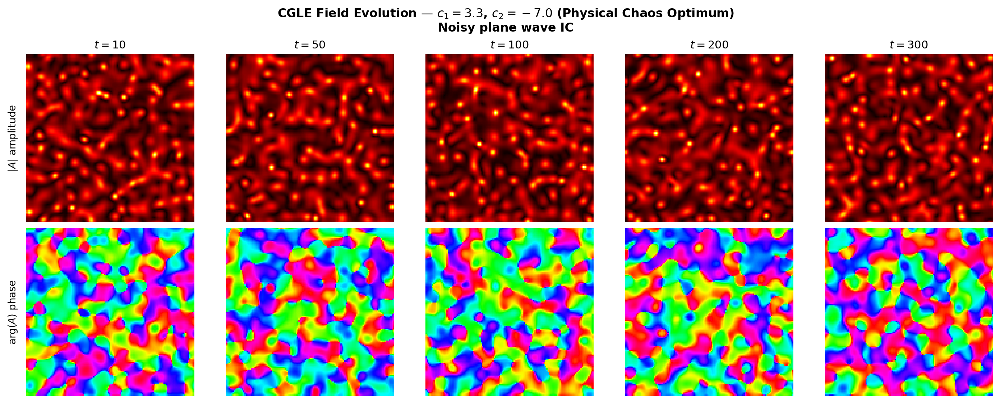

[](https://doi.org/10.5281/zenodo.19228691)
[](https://openreview.net/forum?id=2cUoG4gVFn)

# Autoresearch for Research

<p align="center">
  
</p>

> **Disclaimer:** This work — including all code, experiments, analysis, figures, and the paper — was written almost entirely by Claude (Anthropic). A human provided only high-level direction and big-picture flow; all implementation, scientific reasoning, and writing were performed autonomously by the LLM.

An autonomous LLM research loop that discovers optimal initial conditions across five PDE systems — no training, no human-in-the-loop, just a physics reference and a solver. Inspired by Andrej Karpathy's [autoresearch](https://github.com/karpathy/autoresearch) concept of AI agents autonomously running research experiments.

<p align="center">
  
</p>

## The Approach

We study a minimal *auto-research loop* in which a large language model acts as an autonomous scientific agent:

1. **Hypothesize.** The LLM reads a physics reference and the history of previous experiments, then proposes a new initial condition or parameter set.
2. **Implement.** The LLM writes a Python function encoding the proposed IC.
3. **Run.** A fixed harness executes the PDE solver and computes a scalar score.
4. **Interpret.** The LLM reads the score and metrics, updates its mental model, and returns to step 1.

The LLM is given only: (a) a physics reference document, (b) the fixed solver and scoring code, and (c) the history of all previous experiment results. It is not given the solution; it must discover it.

No problem-specific training, fine-tuning, few-shot examples, or chain-of-thought prompting is used. The same loop structure applies identically across all five domains.

### Why this matters

The loop requires no specialist programming skill, domain-specific training, or large-scale compute. A motivated amateur equipped with a laptop and a physics reference can conduct meaningful scientific investigations that were previously accessible only to trained researchers.

## Repository Structure

```
├── paper/              # LaTeX source, figures, and build scripts
│   ├── autoresearch_for_research.tex
│   ├── references.bib
│   ├── make_figures.py
│   └── figures/
├── Navier-Stokes/      # 3D incompressible NS (vorticity cascade)
├── KS/                 # 1D Kuramoto-Sivashinsky (spatiotemporal chaos)
├── GrayScott/          # 2D Gray-Scott (reaction-diffusion patterns)
├── NLS/                # 1D focusing NLS (rogue waves)
└── CGLE/               # 2D Complex Ginzburg-Landau (spiral waves)
```

Each domain directory contains:
- `prepare.py` — Fixed PDE solver + scoring harness
- `simulate.py` — IC functions written by the LLM
- `program.md` — Physics reference document given to the LLM
- `experiments/` — Full JSON logs of every experiment run

## Results

| Domain | Experiments | Baseline | Best | Gain | Runtime |
|--------|-----------|----------|------|------|---------|
| Navier-Stokes | 33 | 23 | 565 | 24x | ~8h |
| Kuramoto-Sivashinsky | 38 | 3.34 | 6.61 | 2x* | ~2h |
| Gray-Scott | 43 | 0.72 | 5.08 | 7x | ~4h |
| NLS | 98 | 1.0 | 7.71 | 8x | ~3h |
| CGLE | 92 | 0.0 | 12.5 | -- | ~3h |

*\*KS is an attractor system; the low gain reflects a fundamental convergence ceiling, not a failure of the search.*

Key discoveries include super-Peregrine rogue waves via Akhmediev breather interference (NLS), a two-regime transition between genuine chaos and IC-engineering (CGLE), non-monotone bonus-threshold cliffs in Turing pattern space (Gray-Scott), and attractor convergence as a fundamental score ceiling (KS).

<p align="center">
  <br>
  <em>Kuramoto-Sivashinsky: spatiotemporal chaos from optimal odd-sawtooth IC</em>
</p>

<p align="center">
  <br>
  <em>Gray-Scott: Turing pattern evolution at optimal (F, k) parameters</em>
</p>

<p align="center">
  <br>
  <em>NLS: super-Peregrine rogue wave via Akhmediev breather interference</em>
</p>

<p align="center">
  <br>
  <em>CGLE: spiral wave defect chaos at the physical chaos optimum</em>
</p>

## Running

Each domain is self-contained. To run a simulation:

```bash
cd <domain>/
python prepare.py <experiment_name>
```

To regenerate all paper figures:

```bash
cd paper/
python make_figures.py
```

## Paper

The full paper is in `paper/autoresearch_for_research.tex`. Build with:

```bash
cd paper/
pdflatex autoresearch_for_research.tex && bibtex autoresearch_for_research && pdflatex autoresearch_for_research.tex && pdflatex autoresearch_for_research.tex
```

## Citation

```bibtex
@misc{kruger2025autoresearch,
  title={Autoresearch for Research},
  author={Kruger, Michael},
  year={2026},
  howpublished={\url{https://github.com/michK/Autoresearch-for-Research}}
}
```

## License

MIT
